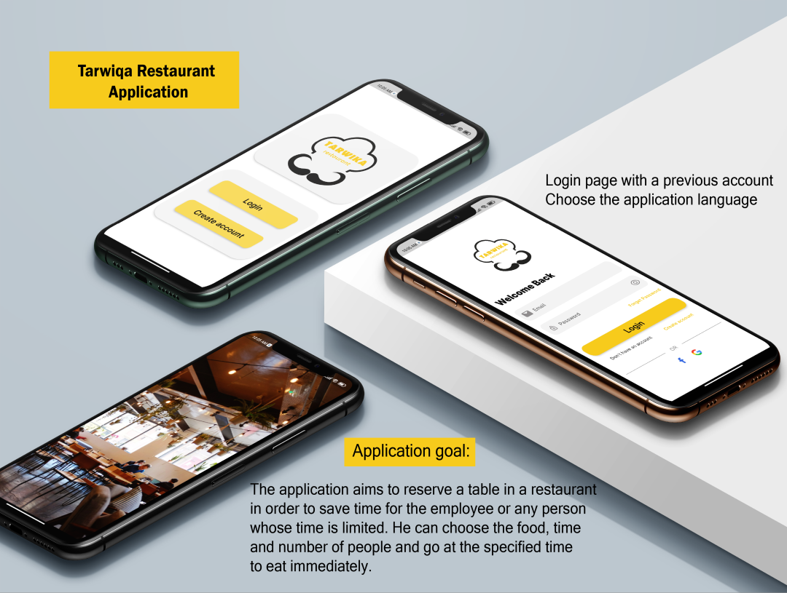
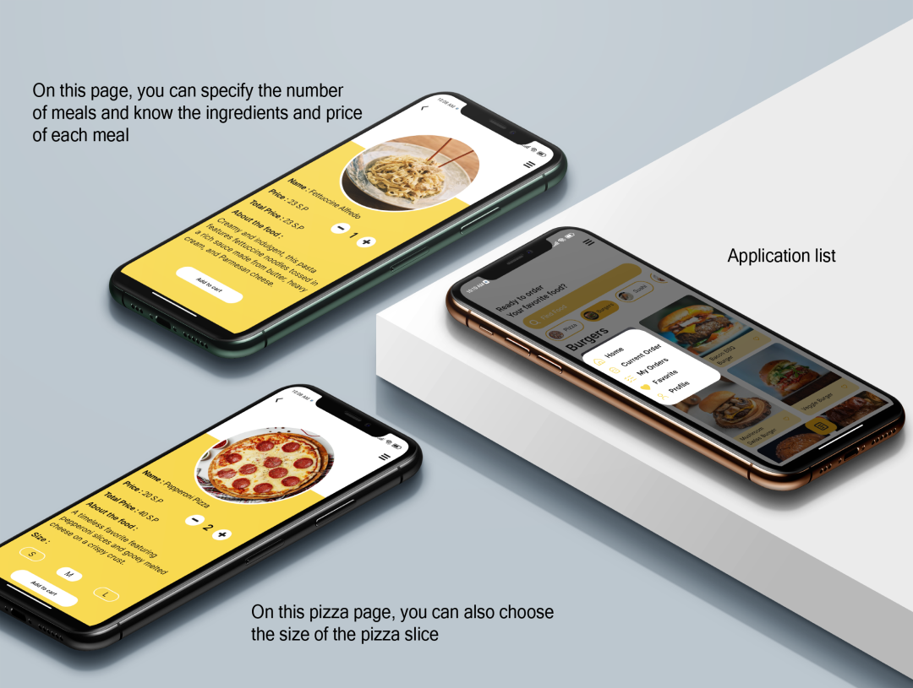
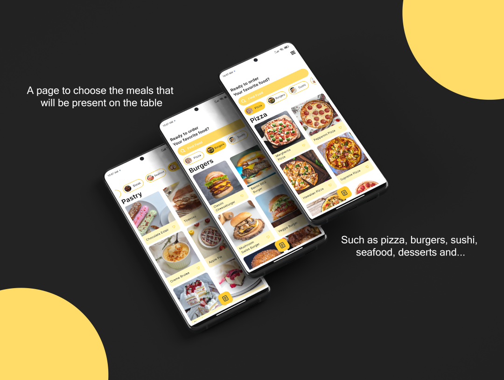

# Tarwika Restaurant Application

Tarwika is a restaurant reservation application designed to streamline the process of reserving
tables and ordering meals in advance. It's particularly useful for employees or anyone with limited
time who wants to have their meal ready upon arrival.

## Table of Contents

- [Features](#features)
- [Screenshots](#screenshots)
- [Installation](#installation)
- [Usage](#usage)
- [Contributing](#contributing)
- [License](#license)

## Features

- **User Authentication**: Secure login and registration for new users.
- **Multilingual Support**: Choose your preferred application language.
- **Menu Browsing**: Browse the restaurant's menu with detailed descriptions and prices.
- **Meal Customization**: Specify the number of meals and customize your orders (e.g., pizza slice
  size).
- **Reservation System**: Reserve tables and specify the time and number of people.
- **Order Summary**: Review your order before finalizing the reservation.

## Screenshots

<div style="display: flex; flex-wrap: wrap; gap: 50px;">





</div>

### Login Page


Choose the application language and login with your account.

### Menu Page


Browse through various meals and see detailed descriptions and prices.

### Customization Page


Customize your meals by specifying details like the size of pizza slices.

### Reservation Page


Select the date and time for your reservation and the number of people.

### Order Summary Page


Review your selected meals before finalizing your reservation.

## Installation

1. **Clone the repository**:
    ```bash
    git clone https://github.com/Ahmad-Nour-Haidar/tarwika.git
    ```

2. **Navigate to the project directory**:
    ```bash
    cd tarwika
    ``` 

3. **Install dependencies**:
    ```bash
    flutter pub get
    ```

4. **Run the application**:
    ```bash
    flutter run
    ```

## Usage

1. **Register or Login**: Open the app and either log in with your existing account or create a new
   one.
2. **Browse Menu**: Explore the menu to find meals you'd like to order.
3. **Customize Order**: Customize your meals as per your preference.
4. **Reserve Table**: Choose the date, time, and number of people for your reservation.
5. **Review and Confirm**: Check your order summary and confirm your reservation.

## Contributing

We welcome contributions to improve this application. Here’s how you can help:

1. **Fork the repository**.
2. **Create a new branch**:
    ```bash
    git checkout -b feature-branch
    ```
3. **Make your changes and commit them**:
    ```bash
    git commit -m "Description of the feature"
    ```
4. **Push to the branch**:
    ```bash
    git push origin feature-branch
    ```
5. **Create a pull request**.

Please ensure your pull request adheres to the following guidelines:

- Describe the feature or fix in detail.
- Ensure the code follows the existing style and conventions.
- Include screenshots or demos of the new feature or fix if applicable.

## License

This project is licensed under the MIT License. See the [LICENSE](LICENSE) file for details.
